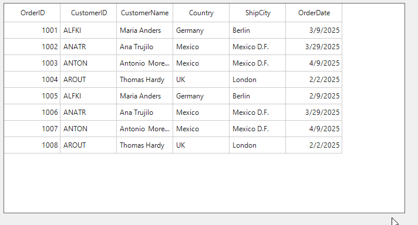

# How to disable real time date validation in DateTimeColumn in WinForms SfDataGrid?

In [WinForms DataGrid](https://www.syncfusion.com/winforms-ui-controls/datagrid) (SfDataGrid), In the [DateTimeColumn](https://help.syncfusion.com/cr/windowsforms/Syncfusion.WinForms.DataGrid.GridDateTimeColumn.html), the default editing mode is [Mask](https://help.syncfusion.com/cr/windowsforms/Syncfusion.WinForms.Input.Enums.DateTimeEditingMode.html). In this mode, the control segments the date into individual fields (such as day, month, and year) and applies real-time validation as each field is edited. This ensures that the entered date remains valid throughout the input process. Therefore, this behavior is by design.

 

This behavior can be customized to disable the real-time validation by setting the [DateTimeEditingMode](https://help.syncfusion.com/cr/windowsforms#Syncfusion_WinForms_DataGrid_GridDateTimeColumn_DateTimeEditingMode/Syncfusion.html) to [Default](https://help.syncfusion.com/cr/windowsforms/Syncfusion.WinForms.Input.Enums.DateTimeEditingMode.html) by overriding the OnInitializeEditElement method of GridDateTimeCellRenderer class.

```csharp
this.sfDataGrid1.CellRenderers.Remove("DateTime");
this.sfDataGrid1.CellRenderers.Add("DateTime", new CustomDateTimeCellRenderer());

public class CustomDateTimeCellRenderer : GridDateTimeCellRenderer
{
    protected override void OnInitializeEditElement(DataColumnBase column, RowColumnIndex rowColumnIndex, SfDateTimeEdit uiElement)
    {
        var dateColumn = column.GridColumn as GridDateTimeColumn;
        if (dateColumn != null)
            dateColumn.DateTimeEditingMode = default;

        base.OnInitializeEditElement(column, rowColumnIndex, uiElement);
    }
}
```


Take a moment to peruse the [WinForms DataGrid - GridDateTimeColumn](https://help.syncfusion.com/windowsforms/datagrid/columntypes#griddatetimecolumn) documentation, where you can find about datetimecolumn with code examples.
